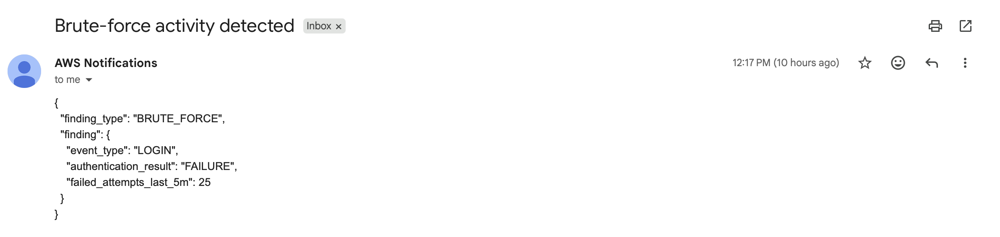
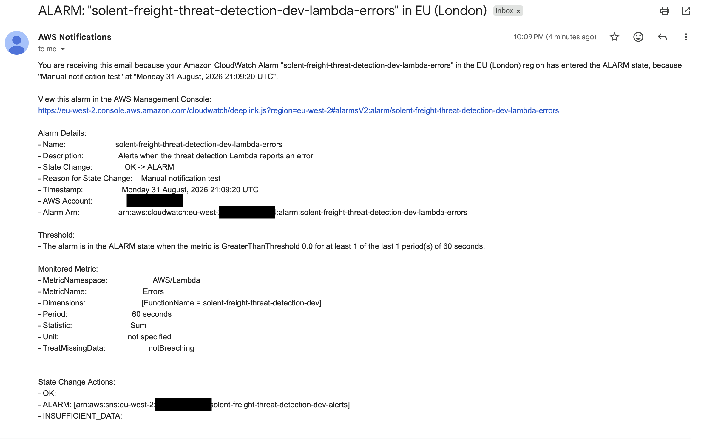

# Real-Time Cybersecurity Threat Detection on AWS

A real-time, event-driven security monitoring system that detects suspicious authentication activity and sends automated email alerts using AWS managed services.

## Project overview

This project simulates a cloud-native security monitoring pipeline for Solent Freight Systems. Security events are submitted to an Amazon Kinesis data stream and processed by an AWS Lambda function written in Python.

The Lambda function decodes each event, applies a brute-force detection rule, writes structured JSON logs to Amazon CloudWatch, and publishes confirmed findings to an Amazon SNS topic. Confirmed subscribers receive the security alert by email.

CloudWatch alarms also monitor the Lambda function for execution errors and throttling.

## Architecture

```text
Security event
      |
      v
Amazon Kinesis Data Streams
      |
      v
AWS Lambda threat detector
      |
      +----> CloudWatch structured logs
      |
      +----> Amazon SNS ----> Email alert

CloudWatch Lambda metrics
      |
      +----> Error alarm ------+
      |                        |
      +----> Throttle alarm ---+----> Amazon SNS ----> Email alert
```

## Detection rule

An event is classified as brute-force activity when all three conditions are true:

- `event_type` is `LOGIN`
- `authentication_result` is `FAILURE`
- `failed_attempts_last_5m` is greater than or equal to `10`

Example event:

```json
{
  "event_type": "LOGIN",
  "authentication_result": "FAILURE",
  "failed_attempts_last_5m": 25
}
```

## AWS services

- **Amazon Kinesis Data Streams** receives and buffers security events.
- **AWS Lambda** decodes events and applies the brute-force detection rule.
- **Amazon CloudWatch Logs** stores structured processing and finding logs.
- **Amazon SNS** distributes brute-force findings and operational alarm notifications by email.
- **Amazon CloudWatch Alarms** monitors Lambda errors and throttling.
- **AWS IAM** grants the Lambda function permission to read Kinesis records, write logs, and publish SNS alerts.
- **AWS KMS** encrypts the Kinesis data stream.
- **Terraform** defines and manages the AWS infrastructure.

## Repository structure

```text
cybersecurity-threat-detection/
|-- docs/
|   |-- detection-rules.md
|   `-- evidence/
|-- infra/
|   |-- main.tf
|   |-- outputs.tf
|   `-- variables.tf
|-- sample-events/
|   |-- failed-login-burst.json
|   `-- normal-login.json
|-- src/
|   |-- detector.py
|   `-- lambda_handler.py
|-- tests/
|   |-- test_detector.py
|   `-- test_lambda_handler.py
|-- README.md
`-- requirements-dev.txt
```

## Prerequisites

Before deploying or testing the project, install and configure:

- Python 3.13 or a compatible Python 3 version
- Terraform
- AWS CLI
- An AWS account with permission to manage Kinesis, Lambda, IAM, CloudWatch, SNS, and KMS resources
- An authenticated AWS CLI profile
- A valid email address for SNS notifications

This project uses the AWS CLI profile `solent-dev` and the AWS Region `eu-west-2`. Replace these values if your environment uses a different profile or Region.

## Local setup

Create and activate a Python virtual environment:

```bash
python3 -m venv .venv
source .venv/bin/activate
```

Install the development dependencies:

```bash
python -m pip install -r requirements-dev.txt
```

## Run the automated tests

Run the complete test suite:

```bash
python -m pytest -v
```

The tests cover:

- Normal login activity that should not create a finding
- Failed-login bursts that should create a brute-force finding
- The exact detection threshold
- Kinesis record decoding
- Mixed Lambda batches
- Malformed-record handling
- SNS publication for confirmed brute-force findings

## Deploy with Terraform

Authenticate the AWS CLI profile used by the Terraform provider:

```bash
aws login --profile solent-dev --region eu-west-2
aws sts get-caller-identity --profile solent-dev --region eu-west-2
```

Create a local Terraform variable file:

```bash
nano infra/alert.auto.tfvars
```

Add the notification email address:

```hcl
alert_email = "your-email@example.com"
```

The `.gitignore` file excludes `*.tfvars`, preventing this file and its email address from being committed.

Initialize and verify the Terraform configuration:

```bash
terraform -chdir=infra init
terraform -chdir=infra fmt -check
terraform -chdir=infra validate
```

Create and review a deployment plan:

```bash
terraform -chdir=infra plan -out=tfplan
```

Apply the reviewed plan:

```bash
terraform -chdir=infra apply tfplan
```

After Terraform creates the SNS email subscription, open the AWS confirmation email and select **Confirm subscription**. SNS will not deliver security notifications until the subscription is confirmed.

## End-to-end detection test

Submit the sample failed-login event to Kinesis:

```bash
aws kinesis put-record \
  --stream-name solent-freight-threat-detection-dev \
  --partition-key documentation-test \
  --data fileb://sample-events/failed-login-burst.json \
  --profile solent-dev \
  --region eu-west-2
```

A successful request returns a shard ID and sequence number. Kinesis then invokes the Lambda function asynchronously.

Inspect the Lambda logs:

```bash
aws logs tail /aws/lambda/solent-freight-threat-detection-dev \
  --since 5m \
  --profile solent-dev \
  --region eu-west-2
```

For a successful detection, the logs include:

- A `brute_force_detected` warning
- A `batch_processed` information message
- `records_failed` equal to `0`
- `findings_created` equal to `1`

The confirmed SNS subscriber should also receive an email with the subject **Brute-force activity detected**.

## Verify operational alarms

Check the Lambda error and throttling alarms:

```bash
aws cloudwatch describe-alarms \
  --alarm-names \
    solent-freight-threat-detection-dev-lambda-errors \
    solent-freight-threat-detection-dev-lambda-throttles \
  --profile solent-dev \
  --region eu-west-2 \
  --query 'MetricAlarms[].{Name:AlarmName,State:StateValue,ActionsEnabled:ActionsEnabled}'
```

During normal operation, both alarms should report `OK`, and their notification actions should be enabled.

## Manual alarm notification test

The notification path can be tested without intentionally breaking the Lambda function. Manually place the error alarm into the `ALARM` state:

```bash
aws cloudwatch set-alarm-state \
  --alarm-name solent-freight-threat-detection-dev-lambda-errors \
  --state-value ALARM \
  --state-reason "Manual notification test" \
  --profile solent-dev \
  --region eu-west-2
```

Confirm the alarm state:

```bash
aws cloudwatch describe-alarms \
  --alarm-names solent-freight-threat-detection-dev-lambda-errors \
  --profile solent-dev \
  --region eu-west-2 \
  --query 'MetricAlarms[0].{Name:AlarmName,State:StateValue,Reason:StateReason}'
```

After confirming that the notification email arrived, return the alarm to `OK`:

```bash
aws cloudwatch set-alarm-state \
  --alarm-name solent-freight-threat-detection-dev-lambda-errors \
  --state-value OK \
  --state-reason "Manual notification test completed" \
  --profile solent-dev \
  --region eu-west-2
```

This manual test verifies the CloudWatch-to-SNS-to-email notification path. It does not simulate a real Lambda execution error or test the alarm's metric evaluation.

## Testing evidence

### Brute-force detection notification

This redacted email confirms that the test event was classified as a brute-force finding and delivered through SNS.



### CloudWatch error-alarm notification

This redacted email confirms that the Lambda error alarm entered the `ALARM` state and delivered a notification through SNS.



More information about the detection logic, response, and possible false positives is available in [the detection-rules documentation](docs/detection-rules.md).

## Troubleshooting

### Expired AWS credentials

If an AWS command reports an expired or invalid security token, authenticate again and verify the active identity:

```bash
aws login --profile solent-dev --region eu-west-2
aws sts get-caller-identity --profile solent-dev --region eu-west-2
```

### Terraform requests the alert email

Terraform prompts for `var.alert_email` when no value has been supplied. Create the ignored local variable file before running a plan:

```hcl
# infra/alert.auto.tfvars
alert_email = "your-email@example.com"
```

Do not commit this file because it contains personal information.

### Inconsistent final plan during apply

An earlier deployment partially created the SNS resources before the AWS provider reported that the Lambda environment block had changed unexpectedly. When an apply partially succeeds:

1. Do not reuse the old saved plan.
2. Allow Terraform to refresh its state.
3. Generate a new plan.
4. Review the new plan carefully.
5. Apply only the newly generated plan.

```bash
terraform -chdir=infra plan -out=tfplan-retry
terraform -chdir=infra apply tfplan-retry
```

### Incorrect SNS email subscription

If the email address is incorrect, update `infra/alert.auto.tfvars`, generate a fresh plan, and apply it. Confirm the new subscription from the email sent by AWS.

List the topic subscriptions with:

```bash
aws sns list-subscriptions-by-topic \
  --topic-arn "$(terraform -chdir=infra output -raw security_alert_topic_arn)" \
  --profile solent-dev \
  --region eu-west-2 \
  --query 'Subscriptions[].{Endpoint:Endpoint,Status:SubscriptionArn}'
```

A confirmed subscription displays its ARN. An unconfirmed subscription displays `PendingConfirmation`. Pending subscriptions cannot be used to receive alerts and are eventually removed by AWS.

## Security considerations

- The Kinesis stream uses server-side encryption with the AWS-managed Kinesis KMS key.
- The Lambda execution role grants access only to the Kinesis stream, CloudWatch log group, and SNS topic required by the project.
- Terraform variable files and state files are excluded from Git because they may contain personal or infrastructure information.
- Evidence screenshots must be redacted before being committed.
- Security events are written to CloudWatch Logs, so production events should not contain passwords, access tokens, or other unnecessary secrets.
- The CloudWatch log group retains logs for 14 days.

## Current limitations

- The detector implements one brute-force login rule.
- The event must already contain `failed_attempts_last_5m`; this version does not calculate that value by aggregating login events.
- Detection state is not stored in a database.
- Findings are delivered by email and are not integrated with a ticketing or incident-management system.
- The project does not automatically block users, IP addresses, or other sources.
- The Terraform AWS provider uses the `solent-dev` profile directly and would need adjustment for another environment.
- The manual CloudWatch alarm test verifies notification delivery but does not generate a real Lambda failure.

## Cost control and teardown

The provisioned Kinesis stream and other AWS resources may incur charges while deployed. Preserve the documentation, test results, and redacted evidence before destroying the infrastructure.

Ensure that `infra/alert.auto.tfvars` contains the same confirmed alert email used by the deployed SNS subscription:

```hcl
alert_email = "your-email@example.com"
```

Create and review a destruction plan:

```bash
terraform -chdir=infra plan -destroy -out=tfplan-destroy
terraform -chdir=infra show tfplan-destroy
```

Apply the reviewed destruction plan:

```bash
terraform -chdir=infra apply tfplan-destroy
```

Verify that Terraform no longer manages any deployed resources:

```bash
terraform -chdir=infra show
```

After successful teardown, remove the local plan and variable files:

```bash
rm infra/tfplan-destroy
rm infra/alert.auto.tfvars
```

Do not destroy the infrastructure until all documentation and evidence have been reviewed, committed, and pushed.
