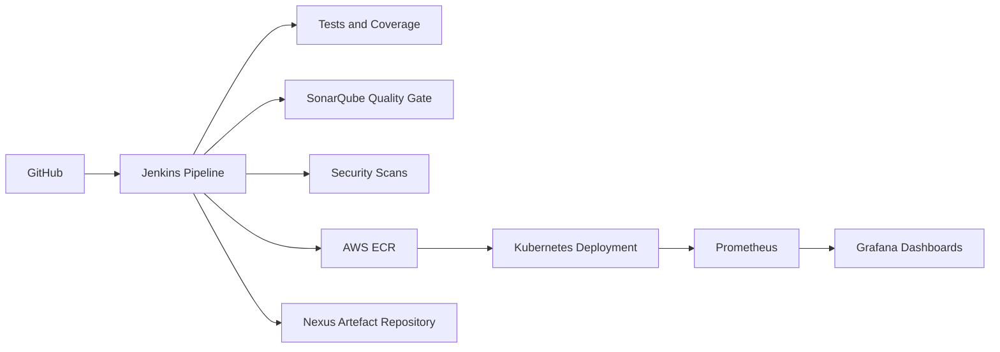
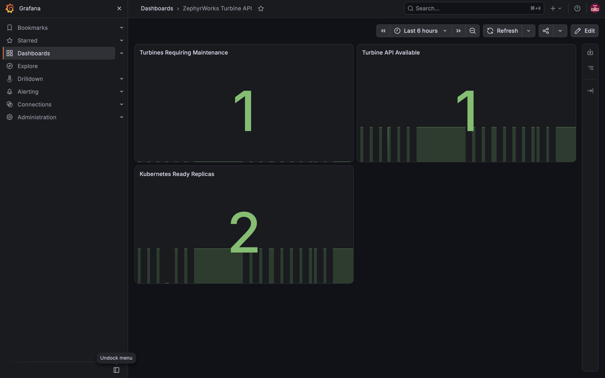

# End-to-End DevSecOps CI/CD Platform

This project demonstrates an automated CI/CD pipeline that builds, tests, scans, stores, deploys, and monitors a Python application on AWS.

## Project Goals

- Build infrastructure using Terraform.
- Run automated tests with Jenkins.
- Check code quality with SonarQube.
- Store build artifacts in Nexus.
- Scan code, dependencies, containers, and infrastructure for security problems.
- Deploy the application to Kubernetes.
- Monitor the platform using Prometheus and Grafana.

## Company Scenario

ZephyrWorks Energy is a fictional UK renewable-energy company that operates wind farms. Its engineers rely on a Python application called the Turbine Maintenance API to view turbine conditions and identify equipment requiring maintenance.

## Business Problem

Software releases are currently performed manually, making them slow, inconsistent, and difficult to audit. Testing and security checks can be missed, while failed releases are difficult to reverse. If engineers cannot access accurate turbine information, maintenance may be delayed and electricity generation may be reduced.

## Proposed Solution

This project creates an automated DevSecOps platform that validates every change, stores approved artefacts, deploys repeatable application versions, monitors system health, and supports recovery from failed releases.

## Success Criteria

- Block deployment when tests, quality checks, or security scans fail.
- Trace every deployed artefact to its source-code commit.
- Deploy application updates without planned downtime.
- Recover from a failed release within ten minutes.
- Display application, platform, and business metrics in Grafana.
- Reproduce and safely remove the AWS infrastructure using Terraform.

## Architecture



## Deployment Safety


The pipeline blocks deployment when tests, the SonarQube quality gate, dependency auditing, infrastructure scanning, or container vulnerability scanning fails.

Container images use immutable tags containing the short Git commit and Jenkins build number. Build reports and metadata are bundled and uploaded to Nexus, providing traceability from source commit to deployed image.

Kubernetes performs rolling deployments across two replicas. If a rollout fails, Jenkins automatically restores the previous deployment revision and verifies that the original image is running.


## Evidence

### Nexus artefact traceability


The Nexus bundle contains build metadata, test results, coverage and security reports. It is uploaded using a dedicated least-privilege Jenkins account.

### Automatic rollback


A controlled test deploys a deliberately missing image. Kubernetes rejects the rollout, Jenkins restores the previous image, verifies the rollback and reports the test build as failed.


### Monitoring dashboard



Prometheus collects application and Kubernetes metrics. Grafana visualises API traffic, latency, health and infrastructure status.

## CI/CD Pipeline

Every detected change to the `main` branch runs the following stages:

1. Verify the build toolchain
2. Install and audit Python dependencies
3. Scan Terraform and Kubernetes configuration
4. Lint and test the application with a 90% coverage gate
5. Run SonarQube analysis and enforce the quality gate
6. Build and scan the non-root container image
7. Push an immutable image to Amazon ECR
8. Publish build evidence to Nexus
9. Deploy to Kubernetes and verify the rollout
10. Restore the previous image automatically if deployment fails

Jenkins polls the repository every five minutes using:

```text
H/5 * * * *
```

## Technology Stack

- Python, Flask and Gunicorn
- Pytest, Ruff and pip-audit
- Docker
- Terraform and Amazon ECR
- Kubernetes
- Jenkins
- SonarQube
- Trivy
- Sonatype Nexus
- Prometheus and Grafana

## Controlled Rollback Test

The Jenkins job includes a TEST_ROLLBACK Boolean parameter. When enabled, the pipeline deliberately attempts to deploy a missing image. The expected result is a failed Jenkins build after the pipeline has restored and verified the previously running image.
Leave this parameter disabled for normal deployments.

## Local Verification

```bash
python3 -m venv .venv
.venv/bin/python -m pip install --requirement requirements-dev.txt
.venv/bin/python -m ruff check app tests
.venv/bin/python -m pytest
terraform -chdir=infrastructure fmt -check
terraform -chdir=infrastructure validate
```

## Application Health
With the Kubernetes service forwarded locally:

```bash
kubectl port-forward service/turbine-api --namespace zephyrworks 8001:80
curl http://127.0.0.1:8001/health
```

Expected response:

```json
{"status":"healthy"}
```

## Project Status
The end-to-end workflow is operational: source changes trigger Jenkins automatically, security and quality gates are enforced, artefacts are traceable, immutable images are deployed to Kubernetes, monitoring is available, and failed rollouts restore the previous image.
