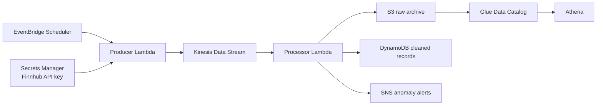

# Stock Market Analytics on AWS

A serverless stock-data pipeline managed with Terraform. EventBridge Scheduler invokes a Finnhub producer during US market hours, Kinesis streams each quote to a processor, and the processor archives raw data, stores cleaned records, and publishes anomaly alerts.

## Architecture



The schedules use `America/New_York`, so EventBridge Scheduler handles daylight-saving changes:

- `cron(30/5 9 ? * MON-FRI *)`: every five minutes from 09:30 through 09:55.
- `cron(0/5 10-15 ? * MON-FRI *)`: every five minutes from 10:00 through 15:55.

These expressions handle weekdays, but not US market holidays or early-closing days.

## Infrastructure as Code

Terraform in [`infra`](infra) manages the existing live resources in account `436856560914`, region `eu-north-1`. The original console-created resources were adopted using declarative import blocks in [`infra/imports.tf`](infra/imports.tf).

The Finnhub secret container is managed, but its secret value is deliberately excluded from Terraform so the API key is not written into Terraform state.

The Lambda source copied from the deployed functions is stored under [`lambda`](lambda). During initial adoption, Lambda code changes are ignored to guarantee that importing cannot overwrite the working deployment. Remove the `ignore_changes` entries only when Terraform should become the Lambda deployment mechanism.

## Safe workflow

Always review a plan before applying:

```bash
terraform -chdir=infra fmt -check -recursive
terraform -chdir=infra validate
terraform -chdir=infra plan -out=change.tfplan
terraform -chdir=infra apply change.tfplan
```

After the initial import, a clean configuration should report:

```text
No changes. Your infrastructure matches the configuration.
```

Never commit `.tfstate`, `.tfplan`, generated ZIP files, `.env` files, or AWS credentials. The repository `.gitignore` excludes these local artifacts.

## Managed resources

- Kinesis stream `stock-market-stream`
- Lambdas `stock-data-producer` and `stock-data-processor`
- DynamoDB table `stock-market-cleaned`
- S3 bucket `stock-market-raw-data-8f3c2a`
- SNS topic and confirmed email subscription
- Secrets Manager secret metadata
- IAM roles, inline policies, managed policies, and attachments
- Kinesis-to-Lambda event source mapping
- Glue database and external raw-data table
- Two EventBridge Scheduler schedules
- Disabled legacy five-minute EventBridge rule
- Lambda CloudWatch log groups

## Security note

The local `terraform-admin` access key has broad permissions for this personal sandbox. Rotate or deactivate it when it is no longer needed. For production, prefer short-lived IAM Identity Center credentials, remote encrypted Terraform state with locking, narrowly scoped roles, deletion protection, and CI/CD-based plans and applies.
