# Project evidence

These screenshots were captured before destroying the AWS resources and are
stored in [`screenshots`](screenshots). Together they document the deployed
architecture, successful processing, observability, analytics and IaC checks.

Do not include access keys, secret values, API keys, email addresses, terminal
credential files, or browser password-manager popups. The AWS account ID is not
a credential, but it may be redacted for a public portfolio.

## Required screenshots

| File | AWS view | What it proves |
| --- | --- | --- |
| `01-kinesis-stream.png` | Kinesis stream summary | Active provisioned stream, retention and stream name |
| `02-producer-lambda.png` | Producer Lambda overview/configuration | Scheduled data producer exists and targets Kinesis |
| `03-processor-lambda.png` | Processor Lambda overview | Kinesis invokes the processing function |
| `04-eventbridge-schedules.png` | EventBridge Scheduler schedules | Market-hours automation and disabled safe state |
| `05-s3-partitions.png` | S3 `raw/` object prefixes | Date/hour partitioned immutable archive |
| `06-dynamodb-records.png` | DynamoDB Explore items | Cleaned queryable stock records |
| `07-cloudwatch-dashboard.png` | Operations metric dashboard | Invocations, errors, duration, throughput and lag |
| `08-cloudwatch-alarms.png` | CloudWatch alarm list/status | Four operational alarms in OK state |
| `09-athena-query-result.png` | Optimized latest-price query | Successful SQL result, 482 ms runtime and 1.24 KB scanned |
| `10-terraform-clean-plan.png` | Terminal with final `terraform plan` | Live AWS resources match the committed IaC |
| `11-tests-and-lint.png` | Terminal test and lint output | Automated checks pass |
| `12-github-repository.png` | GitHub repository root/README | Source and documentation are preserved remotely |

## Optional screenshots

- SNS topics and confirmed subscriptions, with email addresses redacted.
- Glue table columns and projected partition configuration.
- Athena saved-query list showing all four Terraform-managed queries.
- CloudWatch Lambda log entries showing a successful end-to-end record.

## Final commands for evidence

Run these before capturing the terminal screenshots:

```bash
terraform -chdir=infra plan
.venv/bin/pytest -q
.venv/bin/ruff check lambda producer tests
```

The Terraform screenshot should say `No changes`. The test screenshot should
show two passing tests and `All checks passed!` from Ruff.

## Evidence gallery

### Streaming ingestion

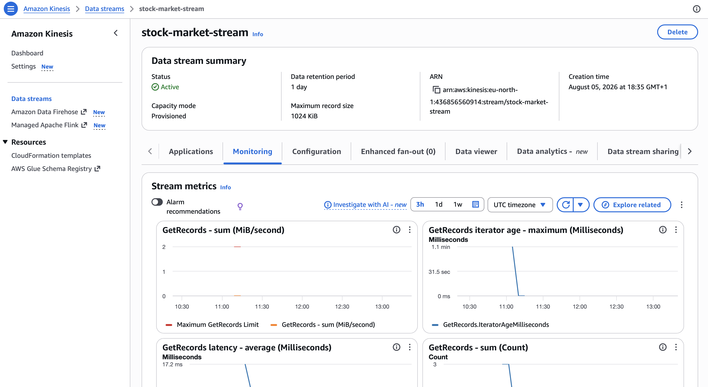

### Lambda processing

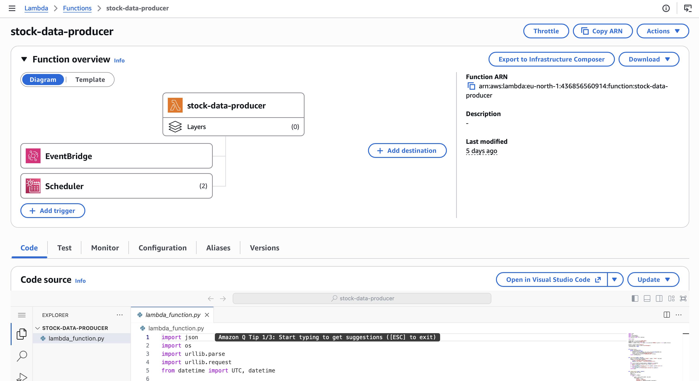

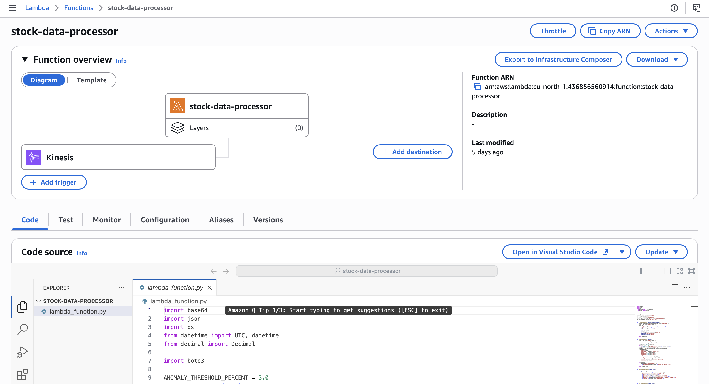

### Scheduling and safe shutdown

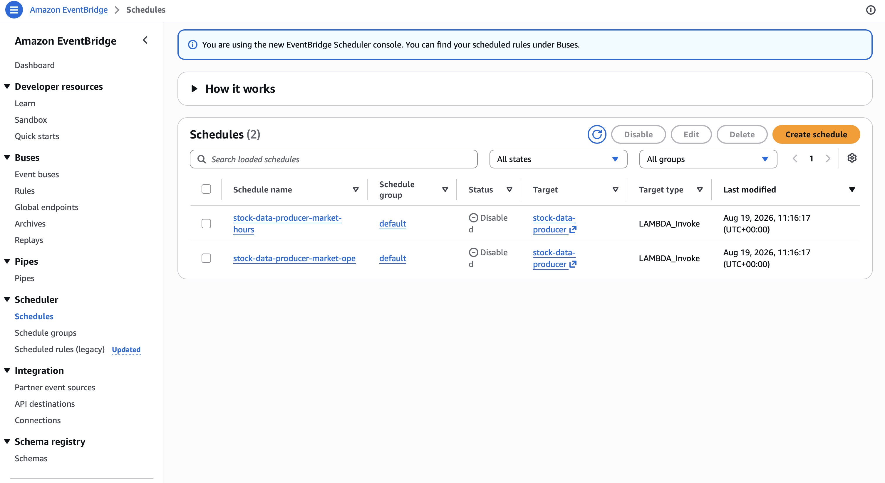

### Data storage

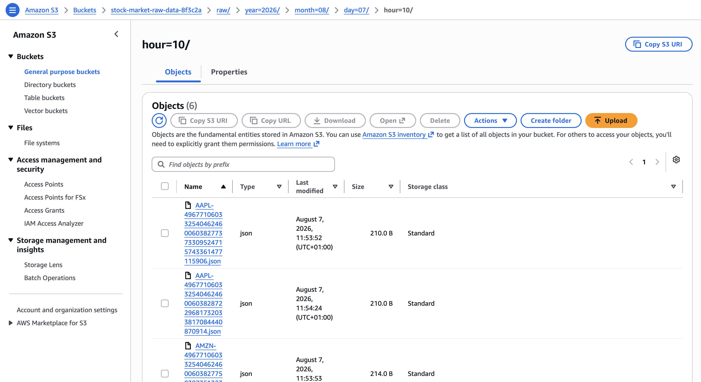

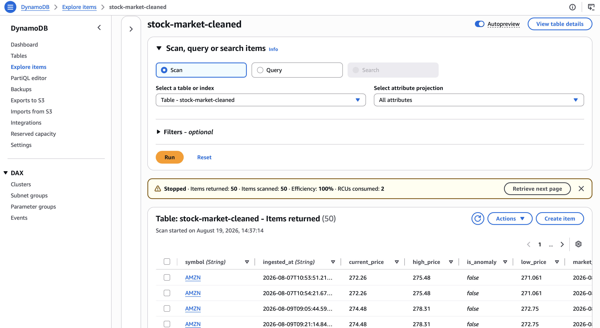

### Operational monitoring

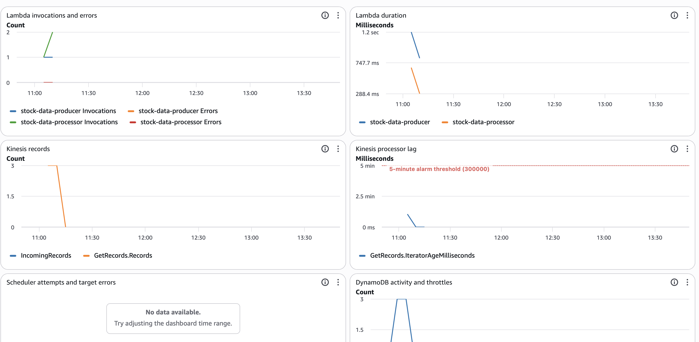

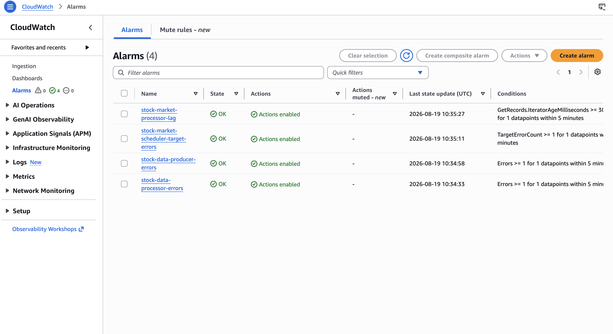

### Historical analytics

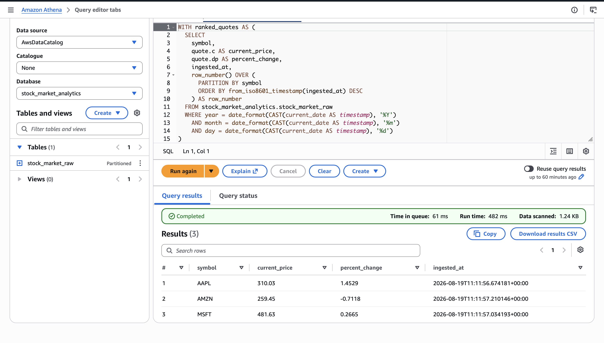

### Infrastructure and code verification

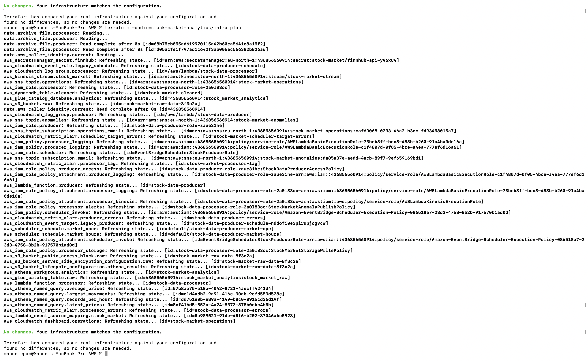

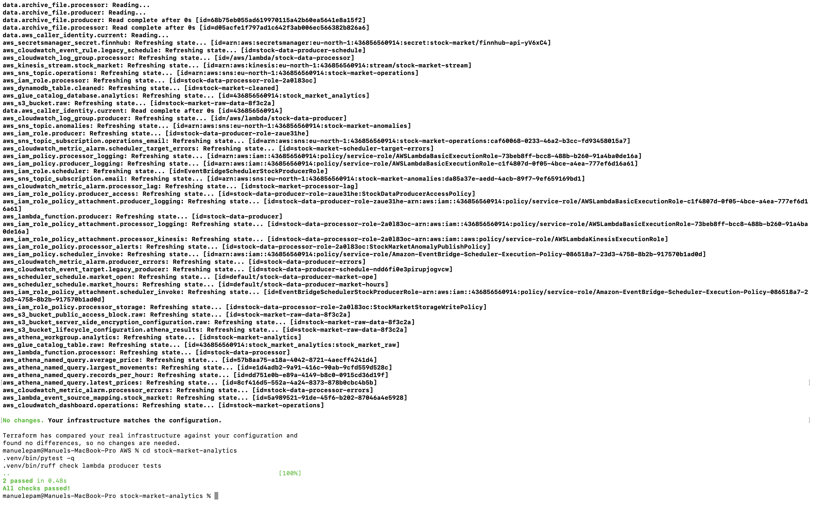

### Published repository

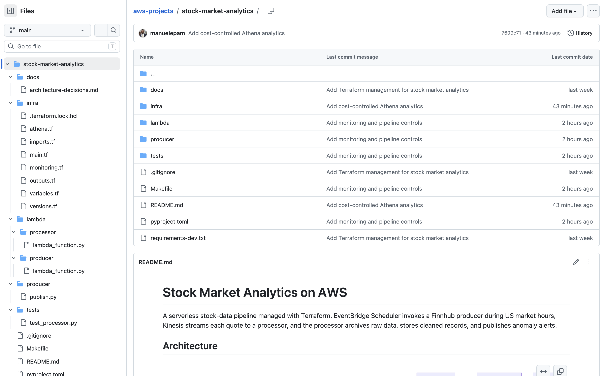
